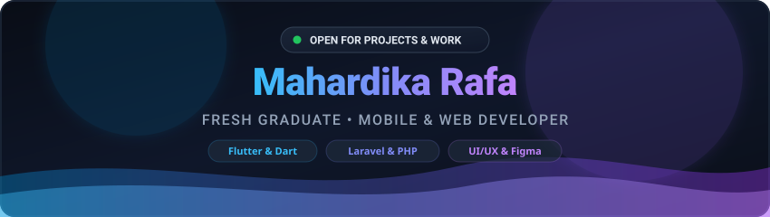

<div align="center">
  

  <!-- Animated Typing Text -->
  <a href="https://github.com/mhrdkrafa">
    
  </a>

  <br/><br/>

  <!-- Status Badges -->
  <a href="mailto:mahardika.raffa04@gmail.com">
    
  </a>
  

  <!-- Social & Contact Badges -->
  <br><br>
  <p align="center">
    <b>🤝 Connect with me:</b>
  </p>
  <a href="mailto:mahardika.raffa04@gmail.com">
    
  </a>
  <a href="https://linkedin.com/in/mahardikarafa" target="_blank">
    
  </a>
  <a href="https://instagram.com/rapuyyyyyy" target="_blank">
    
  </a>
  <a href="https://github.com/mhrdkrafa" target="_blank">
    
  </a>
</div>

<br/>

---

### 👨‍💻 About Me

```javascript
const mahardikaRafa = {
  status: "Fresh Graduate / Open for Projects & Opportunities 🚀",
  role: "Web & Mobile Developer",
  coreTech: ["Laravel","PHP","Dart", "Flutter", "SQL", "Firebase"],
  passions: [
    "Full-Stack Web Development",
    "Mobile App Development",
    "UI/UX Design"
  ],
  currentFocus: "Building cross-platform mobile apps & modern web applications",
  hobbies: ["Coding 💻", "Exploring New Tech 🔍", "Coffee ☕", "Music 🎧", "Gaming 🎮"],
};
```


### 🛠️ Tech Stack & Skills

<div align="center">

#### 💻 Programming Languages
<a href="https://skillicons.dev">
  
</a>

<br/>

#### 🚀 Frameworks
<a href="https://skillicons.dev">
  
</a>

<br/>

#### 🗄️ Database & Cloud Services
<a href="https://skillicons.dev">
  
</a>

<br/>

#### 🎨 Design, Tools & Workflow
<a href="https://skillicons.dev">
  
</a>

</div>


<br/>

<div align="center">
  
</div>
